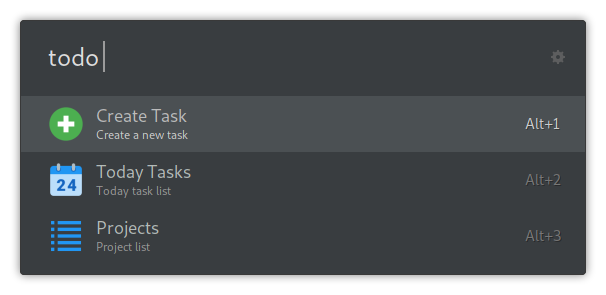

# ulauncher-todoist-ext


> Manage Todoist from Ulauncher.

## Screenshot



## Features

- Lists all Todoist projects
- Add a new Task to Inbox
- Show today task list

## Requirements

- [Ulauncher 5](https://ulauncher.io)
- [Python](https://www.python.org) >= 3

This extension also needs the [todoist-api-python](https://github.com/Doist/todoist-api-python) package.

You can install them in one command using: `pip3 install todoist-api-python`

## Install

Open ulauncher preferences window -> extensions -> add extension and paste the following url:

```
https://github.com/cmuench/ulauncher-todoist-ext
```

Set api token in configuration tab "extensions -> Todoist -> API Token".
You can find your API Token here: [https://todoist.com/prefs/integrations](https://todoist.com/prefs/integrations)


## Usage

On Ulauncher, use "todo" as the default keyword to trigger the extension. By default, it will show a list of running containers.

## Development

```
git clone https://github.com/cmuench/ulauncher-todoist
cd ulauncher-todoist
make help
```

The `make help` target lists all available developer commands, including:

- `make link` — Symlink the repository into the local Ulauncher extensions directory so changes load immediately.
- `make unlink` — Remove the symlink when you are done testing locally.
- `make lint` — Run Pylint on every Python file to catch style and logic issues.
- `make format` — Apply yapf formatting recursively; run before committing to match the project style.
- `make deps` — Install Python dependencies from `requirements.txt` (may require sudo on Linux).
- `make launch-ulauncher-dev` — Launch Ulauncher in development mode without auto-loading extensions.
- `make dev-extension` — Attach this extension to the dev websocket that `make launch-ulauncher-dev` exposes.

After linking, restart Ulauncher from the command line with `make launch-ulauncher-dev` to observe logs while testing the extension.
Because `make launch-ulauncher-dev` uses the `--no-extensions` flag, Ulauncher starts without auto-loading this extension. In another terminal, run `make dev-extension` from the repository root to connect the Todoist extension to the dev websocket with the correct environment variables.

## Contributing

Contributions, issues and Features requests are welcome.

## License

Copyright [Christian Münch](https://github.com/cmuench)

This project is [MIT](LICENSE) Licensed.
